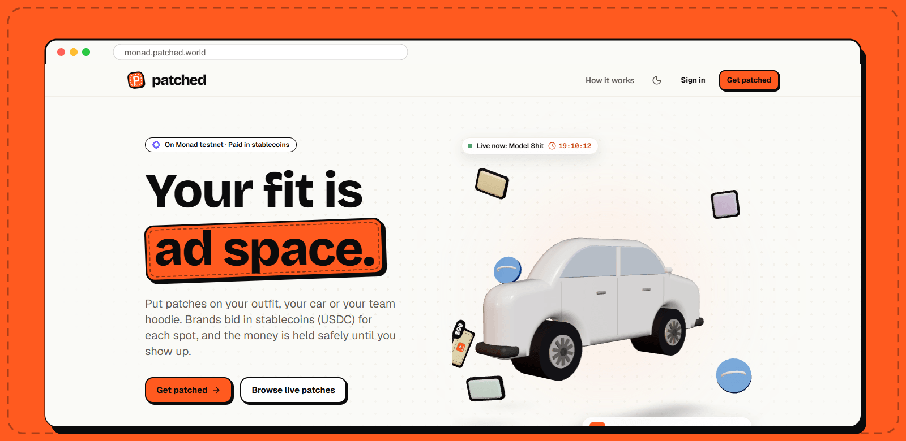
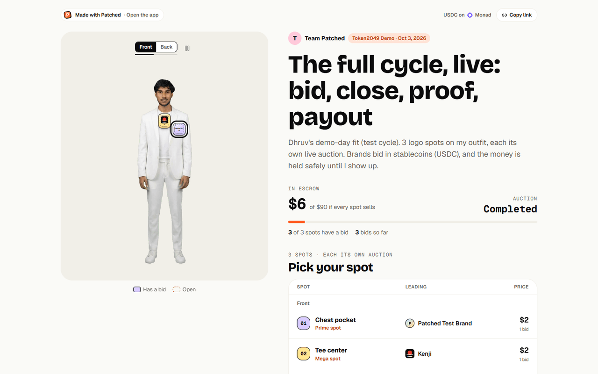
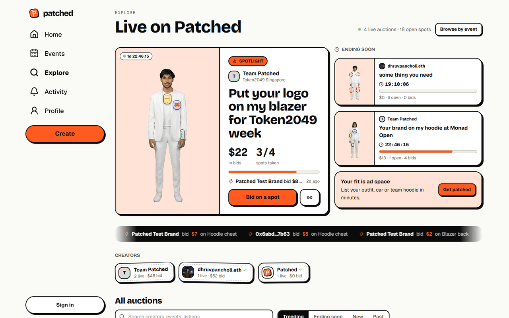
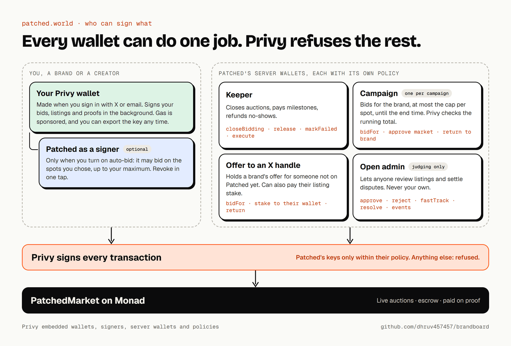
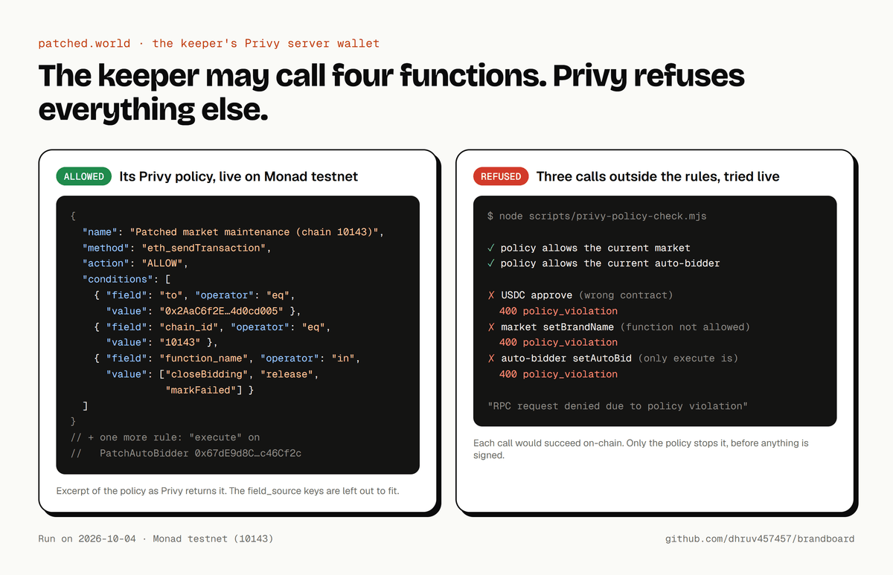
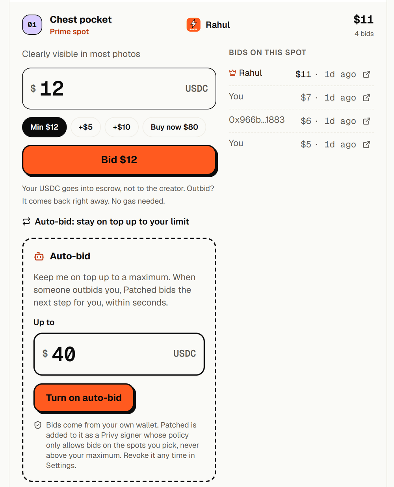
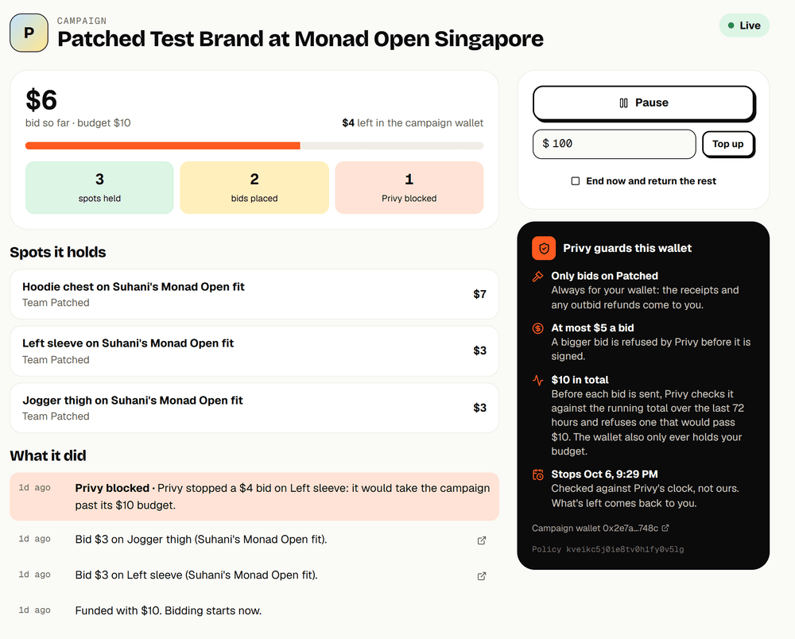
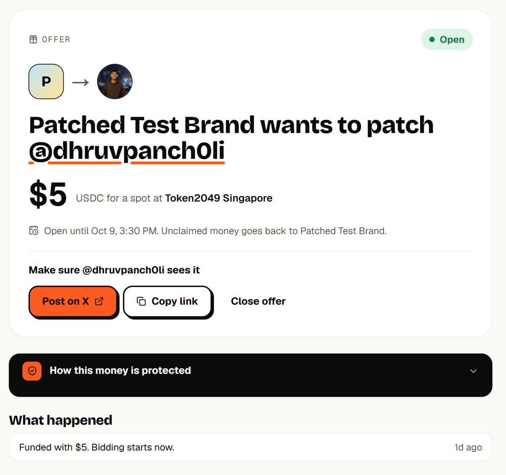
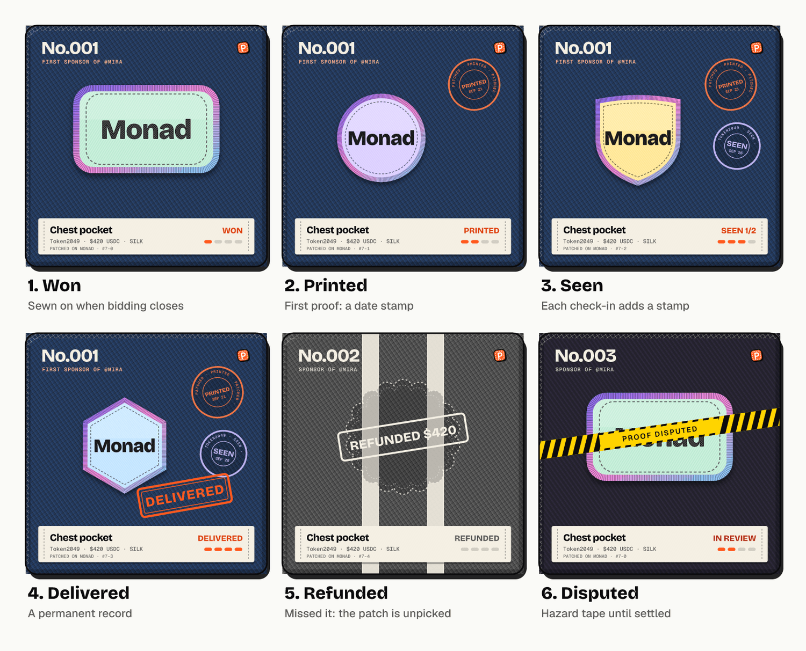

<p align="center">
  
</p>

<h3 align="center">Get patched. Get paid.</h3>

<p align="center">
  Creators sell logo spots on their outfit, car or team hoodie.<br>
  Brands bid for each spot in USDC. The money waits in escrow until the creator proves they showed up.
</p>

<p align="center">
  <a href="https://monad.patched.world"><b>Try it live</b></a> ·
  <a href="https://x.com/Patched_world">X</a> ·
  <a href="https://t.me/+TrSZaCSMngo3YWQ9">Telegram</a> ·
  <a href="docs/contracts.md">Contracts</a> ·
  <a href="docs/privy.md">Privy in detail</a> ·
  <a href="docs/evidence.md">On-chain evidence</a> ·
  <a href="docs/context/README.md">Full project context</a>
</p>

<p align="center">
  
  
  
  
  
</p>

## At a glance

| | |
|---|---|
| **The problem** | A creator sold 13 logo spots on her Token2049 outfit and raised $9,200 in under 48 hours, then fought rejected payments, a hand-built website and fixed prices. Millions of people at events are looking at outfits, cars and team hoodies, and none of that attention can be sold safely. |
| **What we built** | A live auction for every logo spot, paid in USDC, held in on-chain escrow and released only when the creator proves they showed up. Winning a spot mints a patch NFT that redraws itself as the creator delivers. |
| **Live now** | [monad.patched.world](https://monad.patched.world): Monad testnet for play, and **Monad mainnet with real Circle USDC**, on the same address. A switch in the sidebar changes the chain. |
| **Proven on-chain** | The whole money loop (list, bid, outbid refund, auto-bid, sweep, campaign, close, proof, dispute, payout) ran as [25 transactions](docs/evidence.md). 134 contract tests, including fuzz and a solvency invariant. |
| **Privy, beyond login** | 14 Privy features in production: embedded wallets, gas sponsorship, signers with policies, policy-limited server wallets, budgets enforced by Privy aggregations, wallets made for X handles before people sign up, passkey MFA, and more. [How each one works](docs/privy.md). |
| **Real people** | 14 real users and 10 listings by 4 creators on testnet so far (our own wallets left out), a Telegram community, and the Get Patched Week contest running until Oct 12. |
| **Try it in one tap** | Sign in → **Use the demo account**. No email, no seed phrase, no extension. |

## What is Patched

People look at what you wear, drive and ship. That attention is worth money, and until now there was no easy way to sell it.

1. **A creator uploads a photo** of their outfit, car or team hoodie. AI turns it into a clean white canvas.
2. **They mark the spots** where a logo can go. Each spot gets a floor price and a buy-now price.
3. **Brands bid** on each spot in a live auction, in USDC. Outbid someone and their money comes back in the same transaction.
4. **Escrow holds the money.** The creator is paid in steps, only after posting proof: a print photo, then photos from the event.
5. **Winning a spot mints a patch NFT** that grows as the creator proves each step.

Every creator gets their own page at `yourname.monad.patched.world`, so there is no website to build. Patched takes 1%.

<p align="center">
  
</p>

### Where it came from

Before Token2049, a popular creator, [vanshu.eth](https://token2049.vanshu.fun/), posted her event outfit and offered brands the logo spots on it. Brands wanted in: 13 spots sold and $9,200 came in within 48 hours, and her post reached 1.5M views. Then:

- **Her payments got rejected.** Brands paying from abroad hit international transaction rejections at Razorpay.
- **She had to build and run a whole website** just to show the spots and take orders.
- **Every price was fixed.** A brand ready to pay more could not outbid anyone, so a spot went to whoever came first, not to whoever wanted it most.

Patched is the answer to all three: USDC straight to a wallet, a page made for you, and a live auction on every spot.

| Her problem | What Patched does |
|---|---|
| Payments rejected | USDC, straight to a wallet. No bank, no card, no international transaction. |
| A whole website to run | Your own page at `yourname.monad.patched.world`, made for you. |
| Fixed prices, first come first served | Every spot is its own live auction, with a floor, a buy-now price and anti-snipe. |
| Brands paying before you deliver | Escrow. You are paid in steps, only after you post proof. If you don't show up, the brand is refunded. |

## Try it in a minute

<p align="center">
  
</p>

1. Open [monad.patched.world](https://monad.patched.world), press **Sign in**, then **Use the demo account**. One tap signs you in as a brand with its own wallet, on test money only: no email, no seed phrase, no extension.
2. Open a listing, tap a spot and bid. There is no wallet pop-up and no gas prompt. If someone outbids you, your USDC comes back in the same transaction.
3. On a spot, turn on **Auto-bid**. Settings → Security shows exactly what Patched may do, with a one-tap Revoke.
4. Want to sell? Sign in with your own email or X, press **Create**, pick the event (the bidding time fits itself to it), upload a photo and publish. New listings go live within seconds.
5. Look around: **Patchwork** on Home turns an event into a live graph of who sponsored whom. Press **Replay** to watch it build, and **Find me** to see where you sit.

New wallet with $0? The moment a bid needs more than you have, Patched opens the steps: copy your address, paste it into [Circle's faucet](https://faucet.circle.com) on Monad Testnet, and your balance updates by itself. The demo account can't add a passkey (it would lock out the next person). Test USDC token: `0x534b2f3A21130d7a60830c2Df862319e593943A3`.

## Three surfaces

| Surface | What | Proof |
|---|---|---|
| Outfit | A person at an event (for example Token2049) | Print photo, venue photos, an X post |
| Vehicle | A car, van or bus for 1 to 3 event days, parked at the venue or looping it | Dated, located photos each day, an X post |
| Team hoodie | A team at a hackathon, paid out across the team | Team check-in, stage or demo photos, an X post |
| Your own idea | Anything people will see at the event: a laptop lid on stage, a booth wall, a board | Photos with the logo in view, an X post |

## Product map

| Surface | What it does |
|---|---|
| **Home** | A feed of new listings, bids ("Nike unseated Kite and took Chest"), proofs and spotted photos, with likes and comments. Switch to **Patchwork** for the live graph of an event. |
| **Creator page** | `yourname.monad.patched.world`: the creator's own site with the photo, live spots and bids. Editable in place, with a share kit and link previews. |
| **Create** | Photo → AI canvas → AI-placed spots → the deal (payout split, proof dates fitted to the event) → publish. Live within seconds. |
| **Listing** | Every spot is its own auction: one-tap bid, buy now, sweep, auto-bid, anti-snipe, instant outbid refunds, comments. |
| **Automate** | Auto-bid (Patched as a policy-limited signer), campaigns (a budget Privy enforces), and "Patch anyone on X". |
| **Events** | Cover, who's going, leaderboards, a live wall of bids, Spotted photos and Patchwork. |
| **Patch NFTs** | `/patch/<id>`: the living card, its timeline with explorer links, a proof check, and resale. |
| **Profile** | Listings, Collection, Sponsors, and (for you) Campaigns, Earnings and Bids. |
| **Contest** | Get Patched Week: steps checked live, entries, and a lucky draw picked by a block hash. |
| **Admin** | Reports, proofs and disputes, events. Open to anyone on play money, through a policy-limited wallet. |

## Community

Patched is already out of the lab. We build in public and post what we ship.

- **X:** [@Patched_world](https://x.com/Patched_world). Demos, build updates and the hand-drawn patches we make for the launch outfit.
- **Telegram:** [the Patched test group](https://t.me/+TrSZaCSMngo3YWQ9) (public link: [t.me/patchedworld](https://t.me/patchedworld)). Early users are in it already, trying the product on testnet and telling us what to fix.
- **A real first creator.** The idea comes from [vanshu.eth](https://token2049.vanshu.fun/), who sold logo spots on her Token2049 outfit before Patched existed.
- **Get Patched Week.** A community contest (Oct 8 to 12, $30 in real USDC prizes on Monad mainnet) where people list, bid and post proof for real. The lucky draw is picked by a Monad block hash, so anyone can check it: [monad.patched.world/contest](https://monad.patched.world/contest).
- **Building with Privy, in public.** We wrote up everything we learned building on Privy. Privy's CEO replied asking what Privy could improve, and we sent our list: permits and 7702 delegations, passkeys only on big amounts, webhooks for small teams, gas credits in USDC.

| On testnet so far (our own wallets left out) | |
|---|---|
| Real users | 14 (7 signed in with X) |
| Listings | 10, by 4 creators: outfits, cars and team hoodies |
| Real bids | 8, from 4 brands |
| X | 3.4K impressions in a week from a 4-week-old account |

It is early and we say so: a small group, posting regularly, shipping every few days. If you are a creator with an audience or a brand that wants a spot, say hi in the group.

## Built on Monad and Privy

Monad is fast and cheap enough for a live auction: a bid lands in about a second, so the page updates while you watch.

Privy is how nobody has to know they are using a wallet. **Every wallet, signature and payment on Patched goes through it**, and every key we own sits behind a Privy policy.

<p align="center">
  
</p>

| What users get | The Privy piece | Code |
|---|---|---|
| Sign in with X or email, no seed phrase | Embedded wallets with our own sign-in card | [WelcomeView.tsx](apps/web/src/app/welcome/WelcomeView.tsx) |
| Bid in one tap: no pop-up, no gas | Gas sponsorship | [useBid.ts](apps/web/src/lib/market/useBid.ts) |
| Auctions close, pay and refund on time | Keeper server wallet with a 4-call policy | [keeper.ts](apps/web/src/lib/server/keeper.ts) |
| "Keep me on top up to $40" | Signers with a policy, revocable in one tap | [useAutoBid.ts](apps/web/src/lib/market/useAutoBid.ts) |
| "Spend up to $300 at Token2049" | Campaign wallets with a Privy-checked budget | [campaigns.ts](apps/web/src/lib/server/campaigns.ts) |
| Offer money to any X handle, before they sign up | Pregenerated wallets | [xOffers.ts](apps/web/src/lib/server/xOffers.ts) |
| Passkey for big bids, verified brands, wallet export | MFA, linked accounts | [stepUp.ts](apps/web/src/lib/market/stepUp.ts) |
| Judges try it in one tap | Test account and a policy-limited admin wallet | [demoAccount.ts](apps/web/src/lib/server/demoAccount.ts) |

<table>
<tr>
<td width="50%"></td>
<td width="50%"></td>
</tr>
<tr>
<td align="center"><sub>The keeper can call four functions. Privy refuses anything else.</sub></td>
<td align="center"><sub>Auto-bid is a signer on your own wallet, with a maximum.</sub></td>
</tr>
<tr>
<td width="50%"></td>
<td width="50%"></td>
</tr>
<tr>
<td align="center"><sub>A campaign: a budget, a per-spot cap and an end time, written as a policy.</sub></td>
<td align="center"><sub>An offer to an X handle waits in its own wallet until they show up.</sub></td>
</tr>
</table>

The full write-up, with the problem, the lesson and the on-chain proof for each of the eight, is in [docs/privy.md](docs/privy.md).

## The patch NFT that grows up

Winning a spot mints a **Living Patch**, drawn as a collectible trading card: the garment with the brand's embroidered patch sewn on, a price coin, and a four-step track. The picture is drawn by the contract itself and redraws as the creator proves each step: passport stamps pile up for printed and seen, and a DELIVERED stamp lands when the run is done. It *is* the spot: its holder gets the refund and the right to dispute.

<p align="center">
  
</p>

- **Sponsor numbers.** "No.001, first sponsor of @mira": a public record of which brand backed which creator first.
- **Verifiable proofs.** Proof photos and the proof record are pinned to IPFS, and the hash in the contract is the hash of that record. Every patch has a page at `/patch/<token>` with a timeline and a button that fetches the proof, hashes it in your browser and compares it with the chain.
- **Resale with a royalty.** A patch can be resold on Patched while the creator is delivering; 5% goes to the creator. Tokens cannot move any other way.
- The card's frame shows the price: black cotton under $100, iridescent silk to $999, gold foil from $1,000. Each listing's patches come in five shapes, and outfits, cars and team hoodies each get their own drawing. Design and plan: [docs/nft-plan.md](docs/nft-plan.md).

## Verify it yourself

<details>
<summary><b>One full cycle on Monad testnet, 25 transactions</b></summary>

One full cycle ran on Monad testnet on 2026-10-02, with the Privy test account as the brand. Every step is on the
explorer; [docs/evidence.md](docs/evidence.md) has all 25 transactions.

| What | Privy feature | Transaction |
|---|---|---|
| A brand bids from a Privy wallet: no prompt, no gas | Embedded wallet, gas sponsorship | [0x77d837d6…](https://testnet.monadexplorer.com/tx/0x77d837d64256a20cb45fe02cbc3e1305ff977e4e87907b705eb884237666e92b) |
| A rival outbids; the brand is refunded in the same transaction | | [0x419332c5…](https://testnet.monadexplorer.com/tx/0x419332c5a9dde1b0b33bcfe5034208f4d98e9ab46e66077f59e8fb6448268e15) |
| Auto-bid answers within seconds, from the brand's own wallet | Signer with a policy (key quorum) | [0x28e3a8c5…](https://testnet.monadexplorer.com/tx/0x28e3a8c5a43459d4e7b4b6cea90cc91fd99aed62febdb50f5c56074c5adc58b1) |
| Two spots in one sweep, all or nothing | Sponsored gas | [0x0584ad7a…](https://testnet.monadexplorer.com/tx/0x0584ad7a9b11e03fbdbd79abef2585ed0aa5260501884665ad0febeb89f8d3a4) |
| A campaign bids for the brand; Privy refuses the bid that would pass the $10 budget | Server wallet, policy, aggregation | [0x2a5d3397…](https://testnet.monadexplorer.com/tx/0x2a5d3397c267b182a3daef0dce7f854b3713e681ece27e7303b7984a4891e1a3) |
| A brand offers $5 to an X handle; the money waits in its own wallet | Pregenerated wallets, policy | [0x6172ae36…](https://testnet.monadexplorer.com/tx/0x6172ae361a4dcfb6237339da6148e50a94409519a731297ed7f672d1c54e203f) |
| A listing approved by a non-admin through open admin | Policy-limited server wallet | [0x11a6f46c…](https://testnet.monadexplorer.com/tx/0x11a6f46c18c70697cd9ee23007ee68471e39eac5b80b729cbd422a7cf30340ac) |
| The keeper closes bidding 8 seconds after it ends | Keeper server wallet, policy | [0x2d1eb116…](https://testnet.monadexplorer.com/tx/0x2d1eb116841d9ce242685c4d32a4da0bfca97f3bb166e0ce47a807fdd7a34b19) |
| The holder disputes a proof; an admin splits it | | [0x3260057d…](https://testnet.monadexplorer.com/tx/0x3260057d7cd9f4ac083daddee507d7087855b2aa2e05141c53dc9989a1a41861), [0x6df7fed0…](https://testnet.monadexplorer.com/tx/0x6df7fed00c19f7f0829492eeaa2fd3dde069c79923539222fd4383df3c0ba023) |
| The last payout: the listing completes and the creator's stake comes back | Keeper server wallet | [0x99a160d6…](https://testnet.monadexplorer.com/tx/0x99a160d6999785850adf73d43818b1323e8d73888b6e506d1e89ef453d03f602) |

Re-run it: `apps/web/scripts/onchain-cycle.mts` (creator, admin and rival steps) and `apps/web/scripts/browser-steps.mjs`
(the brand, in a browser, as the Privy test account).

</details>

## What is verified, and what isn't

We would rather you trust the parts we can prove.

| Claim | Status |
|---|---|
| The full money loop works on-chain | **Verified on testnet:** 25 transactions in [docs/evidence.md](docs/evidence.md) |
| Mainnet contracts on real USDC | **Deployed** 2026-10-08 (addresses below). Not yet verified on a block explorer; no real-money cycle recorded yet |
| Privy policies refuse anything outside them | **Checked by scripts** in `apps/web/scripts/privy-*-check` against the live policies |
| Contract safety | 134 tests (unit, fuzz, solvency invariant, timing, upgrade). **No independent audit.** Owner, admin and treasury are one deployer key today; a multisig comes before real volume |
| Gas sponsorship | On for testnet. On mainnet, wallets pay their own MON until sponsorship is switched on |
| Traction | Testnet numbers, with our own wallets left out (`apps/web/scripts/metrics.mts`) |

Open admin and the demo account exist for judging and only work on play money.

## Features

<details>
<summary><b>For creators</b></summary>

- **AI canvas.** Upload a photo and AI turns the outfit, car or hoodie into a clean white canvas, with the background removed.
- **AI outfit looks.** AI suggests outfit styles from your photo and generates front and back model shots in the style you pick.
- **AI car views.** Upload one photo of your car and AI generates the other sides (front, left, right, back, roof), so brands can bid on every panel.
- **AI spot suggestions.** AI proposes where the patches should go. You can drag, resize and rename every spot yourself.
- **Your terms.** For each spot, set a starting price, a buy-now price and a tier (mini, prime or mega). Pick the event.
- **Your deal.** Choose how you get paid: part before the event for printing (10% to 50%), all after, per event day, or a custom split of up to 4 steps. A live payout bar shows the split and the proof date of each step. Pick what every brand gets (photos, parked hours, route check-ins, an X post); brands see it before they bid.
- **Stake.** You lock a small bond when you publish. It comes back when you deliver.
- **Editable sponsor page.** Edit your listing page in place: headline, intro, perks per spot, section titles, accent colour, and which sections are shown. The FAQ is editable too.
- **Your own background.** Put a colour or a picture behind your photo, on your page and in the feed. Set it when you publish, change it any time with Edit page → Background.
- **Share kit.** A poster maker with templates, a QR code and downloadable images. Every listing also gets its own link preview image for X and chats.
- **Creator studio.** Close bidding, see the winners, upload proof for each milestone and release your payments.
- **One profile.** `/<handle>` shows your listings, the spots you sponsor and your record. As the owner you also get your Earnings (what needs doing, payouts) and Bids tabs there, so there's no separate dashboard to find.

</details>

<details>
<summary><b>For brands</b></summary>

- **One-tap bidding.** Tap a spot on the photo and a bubble shows the price, who leads and the last few bids. One button bids the minimum to take the lead. Quick chips add +$5, +$10 or buy it now.
- **Full bid sheet.** Enter a custom amount or buy the spot outright.
- **Auto-bid.** "Keep me on top up to $X." When you're outbid, Patched bids the next step for you within seconds, and never above your maximum. It shows "Paused" and tells you what to fix if your wallet runs out of USDC or of spending permission.
- **Sweep.** Pick several spots and bid on all of them in one tap. Either every bid lands or none do.
- **Instant refunds.** When you're outbid, your USDC comes straight back in the same transaction.
- **One-tap rebid.** The outbid toast has a "Bid $X" button that bids the new minimum in one tap.
- **Verified brand badge.** Link your work email. If its domain matches your website, your bids and patches show "Verified brand".
- **Brand profile.** Your brand name and logo appear on the patches you lead.
- **Campaigns.** "Spend up to $300 at Token2049, never more than $40 a spot, until the event ends." A campaign wallet bids across the event for you, cheapest spots first (or prime spots only), and returns what's left at the end. Its rules are a Privy policy you can read in plain words or as JSON, and Privy itself keeps the running total within the budget.
- **Patch anyone on X.** Offer money to any X account for a spot at an event, even if they've never used Patched. Privy creates their account and wallet on the spot; the offer waits in its own policy-limited wallet, can pay their listing stake if their wallet is empty, and buys their spot when they list. Share the offer on X in one tap.
- **Bids tab.** Spots you lead, spots where you were outbid, your receipts, and resale, on your profile.

</details>

<details>
<summary><b>Live auctions</b></summary>

- Every spot is its own auction, with a starting price, a buy-now price and a minimum step of +5% (at least +$5).
- **Anti-snipe:** a bid in the last 5 minutes adds 5 minutes to the whole listing, and everyone on the page is told.
- Live updates within about 2 seconds: prices, leaders and patches move on screen as bids land.
- "N watching now" through Supabase Realtime presence.
- **Bidding war** labels when brands trade the lead, plus recent activity on each spot.
- A live activity feed on every listing, and a live ticker on the landing page.

</details>

<details>
<summary><b>Escrow and trust</b></summary>

- **Paid only on proof.** Money is released in milestones (for example 40% after the print proof and 60% after the show-up proof), each only after proof is posted.
- **72-hour disputes.** Each patch holder can dispute a proof for their own patch within 72 hours. An admin settles it, and can split the payment between creator and brand.
- **No-shows are refunded.** If a creator misses a proof deadline, the unpaid escrow and the creator's stake go to the patch holders.
- **Creator record.** On-chain delivered and missed counts plus total earned, shown on every listing next to the stake and the payout plan.
- **Safe onboarding.** New creators have a spending cap until their first delivery, and every new listing goes live within seconds through a policy-limited Privy wallet that can only approve listings.
- **Living patch NFTs.** Winning a spot mints an NFT drawn on-chain as a trading card with the patch sewn onto the garment. It updates itself as the creator proves each step (won, printed, seen, delivered), goes grey with the patch unpicked if the creator fails, and shows hazard tape while a dispute is open. It *is* the spot: its holder gets refunds and dispute rights. Each one has a public page at `/patch/<token>` with a timeline and a check that hashes the proof from IPFS and compares it with the hash on-chain.
- **Resale.** A receipt can be listed, bought or delisted on Patched, with a 5% royalty to the creator. Receipts can't move outside the market, so the royalty always applies.
- **Fallback payouts.** If a payment to a wallet ever fails, the money waits in the contract and the owner withdraws it. The market can be paused in an emergency.

</details>

<details>
<summary><b>Discovery and social</b></summary>

- **Comments.** Free, one line each, on the whole listing or about one spot. The author and the creator can remove one, and the creator is told.
- **Patchwork.** Home switches between the feed and a living graph of an event: creators, their spots, the brands leading them and the people who spotted them, all connected by what happened on-chain. Replay plays an event back in about 20 seconds.
- **Home feed.** Signed in, `/` is a feed of new listings, bids ("Nike unseated Kite and took Chest on Dhruv · $120", with Outbid) and proofs, with upcoming events, what's ending soon and search alongside.
- **Explore board.** Live listings with search, surface filters, bid counts and a live activity feed.
- **Events.** `/events` lists every event with its cover. `/e/<slug>` has the cover, venue and links, who's going, leaderboards (most sponsored, brand on the most spots, biggest bidding war), every spot and a live wall of bids. Admins edit the cover and details.
- **Notifications.** A live bell and a full `/notifications` page for outbid, new bid, auto-bid placed or paused, won, listing live or rejected, bidding closed, proof posted, dispute opened, payment made, no-show refund and resale sold.

</details>

<details>
<summary><b>Getting around</b></summary>

- **An app shell like X.** A slim sidebar (Home, Events, Explore, Activity, Profile and Create) that never reloads. Once signed in, Automate, Campaigns and Earnings sit under it. Your name and dollar balance sit at the bottom; tapping it opens the wallet: Add money, My bids, Settings, theme, network and sign out.
- **Car pages are a road scene.** The car sits large on a moving road, with the spots of the side you are looking at beside it, so you can bid without scrolling. Car cards in the feed sit on the same road.
- **Printed, not boxed.** When bidding ends, winning brands are printed into the photo: their logo is cut out of its box and blended into the fabric.
- **Phone navigation:** bottom tabs (Home, Events, Create, Activity, Profile) and your avatar at the top for the wallet.
- **A creator's page stands alone.** A listing page is the creator's own site with only a small "Made with Patched" mark, so sharing it on X feels like sharing a site they built.
- **Welcome.** New visitors sign in on a page that plays the whole story (sign in, draw spots, brands bid, show up, get paid) across outfits, vehicles and team hoodies, then pick a name, a handle (checked live) and whether they sell spots, sponsor or both.
- **Settings** (`/settings`): profile, brand (name, logo, website, verified badge), security (passkey, wallet export) and network, in one place.
- **Listing tools:** a creator's listing page, Manage screen and Share kit are tabs of one bar.
- **Testnet and mainnet, one address:** a switch at the bottom of the sidebar (and in the wallet panel and Settings) moves `monad.patched.world` between Monad testnet and Monad mainnet. The address stays the same; only the chain changes. Going to mainnet first says it uses real USDC.
- **Create follows the event:** pick an event and the bidding time fits itself to it, with the event's dates shown and one timeline from bidding to the last proof.
- **Empty wallet, clear steps:** a bid, sweep, auto-bid, stake or campaign that needs more than the wallet holds opens Add money with what's missing and the faucet steps, address included.

</details>

<details>
<summary><b>Admin</b></summary>

- Reported listings and spotted photos: hide or restore them. Three different reporters hide a post at once.
- Review proofs, fast-track milestones and settle disputes.
- Create events, and give each one a cover, venue, city, description and links.

</details>

<details>
<summary><b>Behind the scenes</b></summary>

- **Keeper.** A policy-limited Privy server wallet closes auctions when they end, releases payments after the review window, marks no-shows and runs auto-bids. It also runs campaigns. Every send carries an idempotency key, so a retry never acts twice.
- **Indexer.** Syncs every contract event into Supabase: bids, patches, receipts, payouts and notifications. It's rate-limited when called from the app.
- **Server-side AI.** All AI runs on the server through OpenRouter, with the cheapest model that does each job.
- **Themes and motion.** Light and dark themes. Every animation respects reduced-motion settings.
- **USDC only.** No banks or fiat anywhere: wallets hold USDC. Mainnet runs on real USDC; testnet uses test USDC.

</details>

## Engineering

The hard part is money moving between people who don't trust each other, through wallets they never see. Every boundary has an explicit check.

- **Escrow you can reason about.** All USDC sits in one market contract. Outbid refunds happen in the same transaction (or are credited for withdrawal if a push fails). A solvency invariant test checks the contract always holds what it owes. Anti-snipe is capped by a hard end, deadlines shift if late bids squeeze the first proof, a pause never costs a creator their deadline, and a dispute nobody settles splits 50/50 after 30 days.
- **Proof you can recheck.** Proof photos and a proof record go to IPFS; the contract stores `keccak256` of the record. Each patch page fetches it, hashes it in the browser and compares it with the chain.
- **Keys we hold can only do one job.** The keeper, the approver, open admin, every campaign and every X offer is its own Privy server wallet, owned by our authorization key and limited by a policy to a few named contract calls. Anything else is refused by Privy with `policy_violation` (checked by script).
- **Automation that can't overspend.** Auto-bid runs from the brand's own wallet through a Privy signer whose policy names the spot and the maximum; raising it needs the brand to approve a new policy. Campaign budgets are a Privy aggregation, so Privy, not our server, refuses the bid that would pass the budget.
- **Retries that can't pay twice.** Every keeper and campaign send carries an idempotency key that describes the situation (action, listing, milestone, the top bid it answers), namespaced per chain.
- **A server that never trusts the browser's wallet.** Every acting API route verifies the Privy access token; money routes read the wallet and verified emails from Privy itself. Rate limits on every write, moderation on everything public.
- **An index that can be replayed.** The indexer reads every contract event into Postgres; notifications are unique per event, wallet and kind, so replaying blocks never duplicates anything. A cron keeps the keeper and index moving every minute.
- **Two chains, one codebase.** Chain values live in config; testnet and mainnet are two builds of the same code behind one address. Demo shortcuts switch off by themselves on real money.

## Contracts

| Contract | What it does |
|---|---|
| `PatchedMarket` | Listings, per-patch auctions with anti-snipe, permit bids, escrow, milestones, proofs, disputes, no-show refunds, creator stakes and records, events, resale with royalties. Upgradeable proxy. |
| `PatchReceipt` | The Living Patch NFT for each won patch, with ERC-2981 royalties and ERC-4906 refresh events. It only moves through the market. |
| `PatchRenderer` | Draws each NFT's SVG and metadata from the market's state. Swappable, so the art can be fixed without touching a token. |
| `PatchAutoBidder` | Holds each brand's auto-bid maximum and bids for them. It never goes above the maximum. |
| `PatchSweeper` | Bids on several patches in one transaction, all or nothing. |

| Contract | Monad testnet (10143) | Monad mainnet (143, real USDC) |
|---|---|---|
| PatchedMarket | `0x2AaC6f2E5221078982736F33271CD6484d0cd005` (proxy) | `0xf10a7E612579456401E4d59df7d446158FE7ee9F` (proxy) |
| PatchReceipt, Living Patch | `0x6c406F518E5A863C3c536aD398BA67F8c8Ae5F3A` (listings 11 and later) | `0x6a8CD838489dbafB974A2cB08C86847BE55ea95c` |
| PatchRenderer | `0x6277d2FddAec00DE17C3eBa299FbfAe6F6783B80` | `0x1D864f5b369D63287532D0CC8ed59b057666d540` |
| PatchReceipt, first version | `0xC4Abf876Ef2A6FF1A324F4916c330fe01efAeD4e` (listings 1 to 10) | – |
| PatchAutoBidder | `0x67dE9d8CCB7A79FF57cCf117D73135724c46Cf2c` | `0xD0779dC4E1EE6626E76ec54E7A356877bfc0F47a` |
| PatchSweeper | `0x1c9F3029E4a7Bf86B4E3D7fC64C471E7DBF7cF6B` | `0xB508530bC1752583E6A04b1A9d6c82d9dd7eA4C5` |
| PatchSpotter | `0x0C063771aFEe7f391DC4E851A39ba092ba3f3A44` | `0x6388BDAc2b256Df65CF0f29DFd946Fa2479f32DA` |
| USDC | Monad's test USDC `0x534b…43A3` | Circle USDC `0x754704Bc059F8C67012fEd69BC8A327a5aafb603` |

The new mainnet contracts (real USDC, deployed 2026-10-08) are not verified on a block explorer yet. Testnet uses Monad's test USDC. The earlier testnet market (v2, not upgradeable) was `0xd3808dE425493934f036f8E77ef5a4de332e9552`. Details: [docs/contracts.md](docs/contracts.md).

## Tech stack

- **Contracts:** Solidity 0.8.28, Foundry, OpenZeppelin v5.4, with unit, fuzz and invariant tests (134 passing).
- **Web:** Next.js (App Router), React 19, Tailwind CSS v4, Motion, NumberFlow, viem, Privy.
- **Data:** Supabase (Postgres, Storage, Realtime), with our own indexer in `packages/indexer`.
- **Storage:** proofs and photos on IPFS through QuickNode.
- **AI:** OpenRouter, through `packages/ai`, server side only.
- **Chain:** Monad testnet (10143) and Monad mainnet (143). Chain values live in config.

```
brandboard/
├─ contracts/         Foundry contracts and tests
├─ packages/shared/   ABIs, types, chain config and addresses
├─ packages/ai/       OpenRouter client and prompts
├─ packages/indexer/  Chain events → Supabase
├─ apps/web/          Next.js app
├─ supabase/          Database migrations
└─ docs/              Spec, contracts, design system, plans and evidence
```

## Run it

```bash
pnpm install
pnpm contracts:setup
pnpm contracts:test
cp .env.example .env.local   # then fill in the values
pnpm web:dev                 # the app on Monad testnet
pnpm web:dev:mainnet         # the app on Monad mainnet, http://localhost:3200
```

<details>
<summary><b>Testing the UI</b></summary>

`pnpm --filter web test:ui` runs Playwright against the dev server (start it first with `pnpm web:dev`), in the
Chrome installed on the machine, on a laptop size and a phone size:

- **Every page** ([pages.spec.ts](apps/web/e2e/pages.spec.ts)): it loads, nothing scrolls sideways, no broken
  images, every button and link has a name, and nothing crashes or logs an error. Every internal link on the main
  pages opens. Each page is also saved as a screenshot in `apps/web/e2e/screens/` for a visual review.
- **What people click** ([flows.spec.ts](apps/web/e2e/flows.spec.ts)): sign-in, the app's navigation, the Studio
  deal, the campaign builder and its Privy policy, a listing, an event, Explore search and profile tabs.
- **Signed in** ([signed-in.spec.ts](apps/web/e2e/signed-in.spec.ts)): runs when `E2E_TEST_EMAIL` and
  `E2E_TEST_CODE` hold a Privy test account.

The report is in `apps/web/e2e/report/` (`npx playwright show-report e2e/report` from `apps/web`).

</details>

## Documentation

| Document | What it covers |
|---|---|
| [Project context](docs/context/README.md) | The whole project in one place: product, Privy, contracts, infrastructure, Patchwork, community, go-to-market, roadmap |
| [Privy in detail](docs/privy.md) | Every Privy feature we use, with the code for each |
| [Contracts](docs/contracts.md) | The full contract API, events, errors, upgrades and deployments |
| [On-chain evidence](docs/evidence.md) | Every transaction of the test cycle |
| [Patchwork](docs/patchwork-graph-plan.md) | The live on-chain graph of an event |
| [Patch NFT](docs/nft-plan.md) | The Living Patch card and how it changes |
| [Design system](docs/design-system.md) | Colours, type, motion and components |
| [Data model](docs/data-model.md) | The database tables |
| [Security](SECURITY.md) | How to report a problem |
| [Agent guide](AGENTS.md) | How AI agents work in this repo |

[X @Patched_world](https://x.com/Patched_world) · [Telegram](https://t.me/patchedworld) · [monad.patched.world](https://monad.patched.world)
